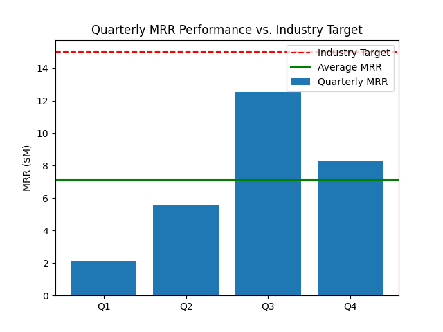

# Quarterly Performance Analysis

**Contact:** 22f3000565@ds.study.iitm.ac.in

## Executive Summary

This report provides an analysis of the company's quarterly Monthly Recurring Revenue (MRR) performance. The data shows a positive growth trend through the first three quarters, but a significant dip in the fourth quarter. The company's average MRR is 7.14, which is below the industry target of 15. This report outlines key findings, business implications, and recommendations to bridge this gap.

## Key Findings

*   **Growth in the first three quarters:** The company experienced strong growth from Q1 to Q3, with MRR increasing from 2.16 to 12.55.
*   **Q4 Decline:** There was a significant drop in MRR in Q4, from 12.55 to 8.27.
*   **Below Industry Target:** The company's performance is consistently below the industry target of 15.
*   **Average MRR:** The average MRR for the year is 7.14.

## Business Implications

*   **Not competitive:** The company is currently not competitive with industry leaders.
*   **Potential for churn:** The Q4 decline could indicate a problem with customer churn or a slowdown in new customer acquisition.
*   **Opportunity for growth:** The strong performance in the first three quarters shows that the company has the potential to grow if it can address the issues that led to the Q4 decline.

## Recommendations

To reach the industry target of 15, the company should focus on the following:

*   **Investigate the Q4 decline:** It is critical to understand the reasons for the drop in MRR in Q4. This could be due to seasonal trends, increased competition, or internal factors.
*   **Focus on customer retention:** Implement strategies to reduce churn and increase customer lifetime value.
*   **Accelerate customer acquisition:** To reach the target of 15, the company should **expand into new market segments**.

## Visualization

